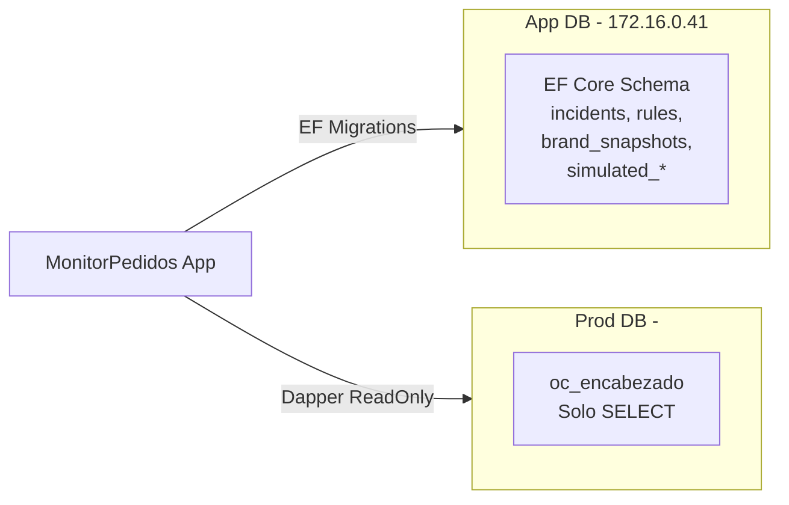

# Plan de Migración: PostgreSQL → SQL Server + M2 Per-Channel

## 1. Cambios de Base de Datos

### 1.1 Arquitectura de Dos Bases de Datos

| Conexión | Servidor | Base de Datos | Provider | Uso |
|----------|----------|---------------|----------|-----|
| `DefaultConnection` | 172.16.0.41 | MonitorPedidosDb | EF Core (SQL Server) | Incidents, Rules, Snapshots, Simulación |
| `ProductionDb` | <IP_SERVIDOR_BD> | <NOMBRE_BD_PRODUCCION> | Dapper (solo SELECT) | `oc_encabezado` (M2) |

### 1.2 Flujo de Migración



### 1.3 Archivos Modificados

#### `.env` (gitignored — contiene credenciales reales)
```
ConnectionStrings__DefaultConnection=Server=172.16.0.41;Database=MonitorPedidosDb;User Id=<DB_USER>;Password=<DB_PASSWORD>;TrustServerCertificate=True;Encrypt=True
ConnectionStrings__ProductionDb=Server=<IP_SERVIDOR_BD>;Database=<NOMBRE_BD_PRODUCCION>;User Id=<DB_USER>;Password=<DB_PASSWORD>;TrustServerCertificate=True;Encrypt=True
```

#### `src/MonitorPedidos.Web/appsettings.json` — Placeholders (sin credenciales)
```json
"ConnectionStrings": {
    "DefaultConnection": "",
    "ProductionDb": ""
}
```

#### `src/MonitorPedidos.Infrastructure/MonitorPedidos.Infrastructure.csproj`
- Cambio: `Npgsql.EntityFrameworkCore.PostgreSQL` → `Microsoft.EntityFrameworkCore.SqlServer` 8.*
- Nuevo: `Dapper` 2.1.79

### 1.4 Migraciones EF Core

```bash
# Generar migración inicial para SQL Server (ya ejecutado)
dotnet ef migrations add InitialCreate --project src/MonitorPedidos.Infrastructure --startup-project src/MonitorPedidos.Web

# Aplicar al App DB
dotnet ef database update --project src/MonitorPedidos.Infrastructure --startup-project src/MonitorPedidos.Web
```

**Tablas creadas:**
- `incidents`
- `rules`
- `rule_history`
- `brand_snapshots`
- `simulated_orders`
- `simulated_job_statuses`

---

## 2. Cambios M2 — BD Pedidos (Per-Channel)

### 2.1 Objetivo

M2 ahora mide si **cada canal** (Salesforce, Multivende) tiene pedidos en una ventana configurable de tiempo (default 10 min), consultando `oc_encabezado` en la base de producción (solo lectura).

### 2.2 Query Principal

```sql
SELECT ChannelName, COUNT(*) AS Total
FROM oc_encabezado
WHERE FechaGeneracion >= DATEADD(minute, @WindowMinutes, GETDATE())
GROUP BY ChannelName;
```

Canales esperados: `["SALESFORCE", "MULTIVENDE"]` (case-insensitive)

### 2.3 Resultado Esperado (UI)

| Estado | Dashboard |
|--------|-----------|
| ✅ TODO OK | `✔ M2 BD Pedidos` → Salesforce (40 ped) ✅, Multivende (25 ped) ✅ |
| ⚠️ Parcial | `🔴 M2 BD Pedidos` → Salesforce (0 ped) ❌, Multivende (20 ped) ✅ |
| 🔴 Total | `🔴 M2 BD Pedidos` → Salesforce (0 ped) ❌, Multivende (0 ped) ❌ |

### 2.4 Archivos Nuevos

#### `src/MonitorPedidos.Infrastructure/Persistence/ProductionOrderRepository.cs`

Implementa `IOrderSource` usando Dapper contra `oc_encabezado`.

```csharp
public sealed class ProductionOrderRepository(string connectionString) : IOrderSource
{
    public async Task<IReadOnlyList<OrderSnapshot>> GetOrdersInWindowAsync(
        DateTimeOffset from, DateTimeOffset to, CancellationToken ct = default)
    {
        await using var conn = new SqlConnection(_connectionString);
        await conn.OpenAsync(ct);
        var rows = await conn.QueryAsync<OrderRow>(
            "SELECT ChannelName, FechaGeneracion FROM oc_encabezado WHERE FechaGeneracion >= @From AND FechaGeneracion <= @To",
            new { From = from.UtcDateTime, To = to.UtcDateTime }, commandTimeout: 30);
        return rows.Select(r => new OrderSnapshot(r.ChannelName, new DateTimeOffset(r.FechaGeneracion, TimeSpan.Zero), false)).ToList();
    }
}
```

**Solo SELECT** — sin DELETE, UPDATE, ALTER.

### 2.5 Archivos Modificados

#### `src/MonitorPedidos.Web/Features/Monitoring/DbOrderChecker.cs`

Cambios principales:
- Inyecta `ILogger<DbOrderChecker>` para logging
- Si hay reglas activas: usa `WindowMinutes` o `WindowHours * 60` para la ventana
- Si no hay reglas: defaults → 10 min ventana, 1 pedido mínimo
- Agrupa órdenes por `OrderId` (que es el channel name) usando `StringComparer.OrdinalIgnoreCase`
- Por cada canal en `ExpectedChannels`: verifica count ≥ minOrders
- Retorna `CheckResult` con detalles en formato: `SALESFORCE:40:OK|MULTIVENDE:0:CRITICAL`

#### `src/MonitorPedidos.Domain/Rules/RuleCondition.cs`

- Nuevo campo: `int? WindowMinutes`
- `ForDbOrders(int windowMinutes, int minOrders)` — ahora recibe minutos en lugar de horas
- `IsValidForModule` para DbOrderChecker: solo requiere `MinOrders.HasValue`

#### `src/MonitorPedidos.Web/Program.cs`

Registro condicional de `IOrderSource`:
```csharp
var prodConn = builder.Configuration.GetConnectionString("ProductionDb");
if (!string.IsNullOrEmpty(prodConn))
    builder.Services.AddScoped<IOrderSource>(_ => new ProductionOrderRepository(prodConn));
else
    builder.Services.AddScoped<IOrderSource, SimulatedOrderRepository>();
```

#### `src/MonitorPedidos.Web/Features/Monitoring/AlertTemplateRenderer.cs`

Template `(CauseCategory.Bd, Severity.Critical)` ahora usa `ctx.CheckDetails` como `QuePaso` — muestra los detalles por canal directamente.

#### `src/MonitorPedidos.Web/Components/Pages/Dashboard.razor`

- `DomainCard` agrega `List<ChannelItem>? Channels`
- Nuevo `record ChannelItem(string Name, int Count, bool IsOk)`
- En `UpdateDomainCard`: si `inc.Module == DbOrderChecker`, parsea `Alert.QuePaso` y extrae `ChannelItem` list
- Render: dentro de la tarjeta M2, sub-rows por canal con count y ✅/❌

#### `src/MonitorPedidos.Web/Components/Pages/Noc/NocPage.razor`

Mismos cambios que Dashboard: `DomainCard` con `Channels`, parsing y render de sub-rows.

#### `src/MonitorPedidos.Web/Components/Pages/Rules/RuleEditPage.razor`

- Label: "Ventana (horas)" → "Ventana (minutos)"
- Campo: `_windowHours` → `_windowMinutes` (default 60)
- Save: `ForDbOrders(_windowMinutes, _minOrders)`

### 2.6 Tests

#### `tests/MonitorPedidos.UnitTests/Monitoring/DbOrderCheckerTests.cs`

7 tests:
| Test | Escenario | Resultado |
|------|-----------|-----------|
| `NoOrders` | Sin órdenes | CRITICAL |
| `AllChannelsHaveOrders` | Ambos canales con 1+ pedido | OK |
| `OnlyCancelledOrders` | Todas canceladas | CRITICAL |
| `SalesforceZero` | Solo Multivende tiene pedidos | CRITICAL (Salesforce:0) |
| `BelowMinOrders` | minOrders=5, solo 1 por canal | CRITICAL |
| `NoActiveRules` | Sin reglas, usa defaults, sin pedidos | CRITICAL |
| `Module_IsDbOrderChecker` | Verifica ModuleId | DbOrderChecker |

#### Tests de regresión actualizados:
- `CauseClassifierTests`: agrega `ILogger<DbOrderChecker>` mock
- `AlertTemplateRendererTests`: `QuePaso` ahora es `ctx.CheckDetails` en BD-CRITICAL
- `RuleManagementServiceIntegrationTests`: `ForDbOrders(2,1)` → `ForDbOrders(120,1)`
- `RuleManagementServiceValidationTests`: `ForDbOrders(2,1)` → `ForDbOrders(120,1)`

---

## 3. Estado Actual (Build + Tests)

```
Build: 0 errors, 0 warnings
Tests: 44/44 Unit + 5/5 Integration → ✅ Todos pasan
App:   http://localhost:5000 corriendo
       M2: SALESFORCE:0:CRITICAL | MULTIVENDE:0:CRITICAL ✅
       M4: SELECT 1 OK ✅
       M11: Jobs simulados OK ✅
       M12: BrandMonitor OK ✅
       M3: APIs externas — fallo DNS (esperado desde red local)
```

---

## 4. Pendientes para Producción

1. **Credenciales App DB (172.16.0.41)** — Configurar usuario con permisos de escritura para EF Core
2. **Credenciales Prod DB (<IP_SERVIDOR_BD>)** — Usuario solo SELECT (no DELETE/UPDATE/ALTER)
3. **Actualizar `.env`** con las credenciales correctas
4. **Ejecutar**: `dotnet ef database update` contra App DB
5. **M11 Jobs** — Integrar con Windows Task Scheduler real (pendiente)
6. **M3 APIs** — Configurar URLs y API keys reales de Salesforce/Multivende
